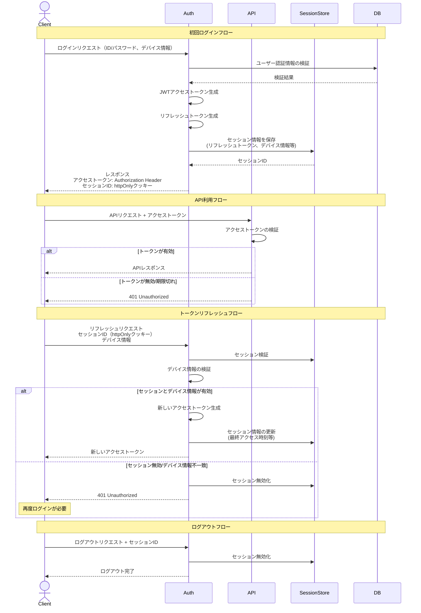
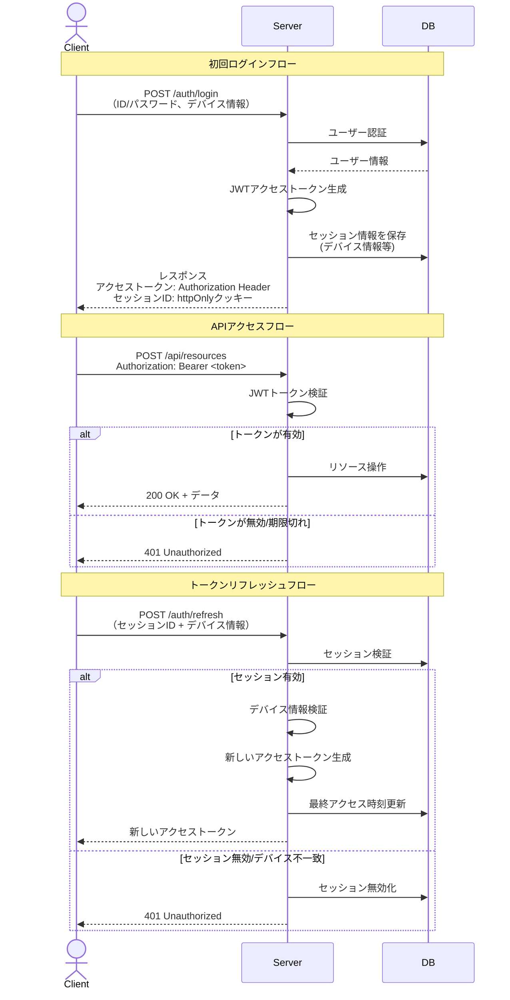

# 認証機能の設計

## 理想のフロー図

```mermaid
sequenceDiagram
    actor Client
    participant Auth
    participant API
    participant SessionStore
    participant DB

    %% 初回ログインフロー
    Note over Client,DB: 初回ログインフロー
    Client->>Auth: ログインリクエスト（ID/パスワード、デバイス情報）
    Auth->>DB: ユーザー認証情報の検証
    DB-->>Auth: 検証結果
    Auth->>Auth: JWTアクセストークン生成
    Auth->>Auth: リフレッシュトークン生成
    Auth->>SessionStore: セッション情報を保存<br/>(リフレッシュトークン、デバイス情報等)
    SessionStore-->>Auth: セッションID
    Auth-->>Client: レスポンス<br/>アクセストークン: Authorization Header<br/>セッションID: httpOnlyクッキー

    %% API利用フロー
    Note over Client,DB: API利用フロー
    Client->>API: APIリクエスト + アクセストークン
    API->>API: アクセストークンの検証
    alt トークンが有効
        API-->>Client: APIレスポンス
    else トークンが無効/期限切れ
        API-->>Client: 401 Unauthorized
    end

    %% トークンリフレッシュフロー
    Note over Client,DB: トークンリフレッシュフロー
    Client->>Auth: リフレッシュリクエスト<br/>セッションID（httpOnlyクッキー）<br/>デバイス情報
    Auth->>SessionStore: セッション検証
    Auth->>Auth: デバイス情報の検証
    alt セッションとデバイス情報が有効
        Auth->>Auth: 新しいアクセストークン生成
        Auth->>SessionStore: セッション情報の更新<br/>(最終アクセス時刻等)
        Auth-->>Client: 新しいアクセストークン
    else セッション無効/デバイス情報不一致
        Auth->>SessionStore: セッション無効化
        Auth-->>Client: 401 Unauthorized
        Note over Client: 再度ログインが必要
    end

    %% ログアウトフロー
    Note over Client,DB: ログアウトフロー
    Client->>Auth: ログアウトリクエスト + セッションID
    Auth->>SessionStore: セッション無効化
    Auth-->>Client: ログアウト完了
```

## 一時的には以下のフローで実装

```mermaid 
sequenceDiagram
    actor Client
    participant Server
    participant DB

    %% 初回ログインフロー
    Note over Client,DB: 初回ログインフロー
    Client->>Server: POST /auth/login<br/>（ID/パスワード、デバイス情報）
    Server->>DB: ユーザー認証
    DB-->>Server: ユーザー情報
    Server->>Server: JWTアクセストークン生成
    Server->>DB: セッション情報を保存<br/>(デバイス情報等)
    Server-->>Client: レスポンス<br/>アクセストークン: Authorization Header<br/>セッションID: httpOnlyクッキー

    %% APIアクセスフロー
    Note over Client,DB: APIアクセスフロー
    Client->>Server: POST /api/resources<br/>Authorization: Bearer <token>
    Server->>Server: JWTトークン検証
    alt トークンが有効
        Server->>DB: リソース操作
        Server-->>Client: 200 OK + データ
    else トークンが無効/期限切れ
        Server-->>Client: 401 Unauthorized
    end

    %% トークンリフレッシュフロー
    Note over Client,DB: トークンリフレッシュフロー
    Client->>Server: POST /auth/refresh<br/>（セッションID + デバイス情報）
    Server->>DB: セッション検証
    alt セッション有効
        Server->>Server: デバイス情報検証
        Server->>Server: 新しいアクセストークン生成
        Server->>DB: 最終アクセス時刻更新
        Server-->>Client: 新しいアクセストークン
    else セッション無効/デバイス不一致
        Server->>DB: セッション無効化
        Server-->>Client: 401 Unauthorized
    end
```
